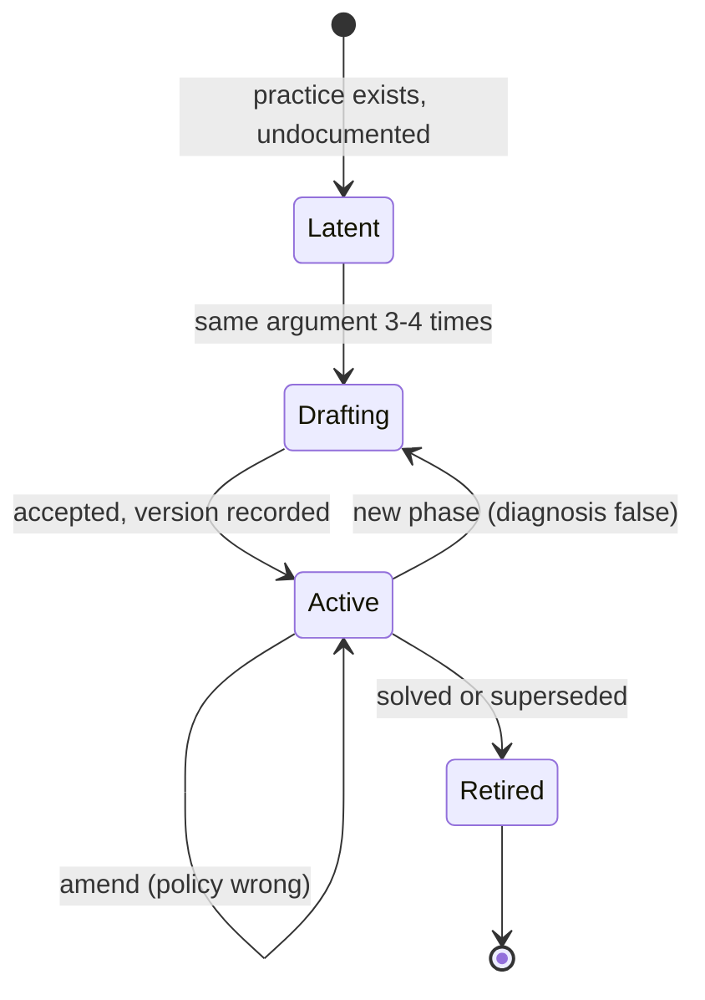

# Research: The evidence base for an agentic delivery strategy

Three questions, investigated together because the answer to each constrains the others. Commissioned by `#57`; questions two and three arose during that work and are carried here rather than split into separate records.

1. **How do you write a strategy document**, when you have never written one?
2. **Where does agent use stop being efficient**, and how are organisations of different sizes answering that?
3. **What pain do organisations feel moving to an agent-first approach**, and does it differ by function?

## Why This Was Asked

`#36` requires an agentic delivery strategy, and thirteen further strategy and policy documents follow it in Milestone 0. Three gaps blocked it.

The author has not written a strategy document before, so the artefact itself was unfamiliar. The autonomy boundary at the heart of the strategy had been framed purely as a **risk** question — what an agent may be trusted to do — with no account of the **economics**: work an agent is permitted to do but does more slowly, once verification is counted, should not be given to an agent. And the programme puts one person in every functional role at once, so whether agent-first pain is function-specific or universal determines whether the strategy states one set of rules or several.

## Scope and Method

**Part 1 (strategy writing)** draws predominantly on Will Larson's *Crafting Engineering Strategy* (2025), published in full online, which applies Richard Rumelt's framework specifically to engineering, plus Rumelt's kernel and Roger Martin's definition of strategy as choice.

**Part 2 (efficiency boundary)** draws on field experiments, large-scale delivery surveys, enterprise agent deployment and governance data, and official statistics on adoption by firm size.

**Part 3 (pain points)** applies a **hard currency constraint: only fieldwork conducted or published in 2026 was admitted.** Consequently the two strongest methodological sources in Part 2 — METR's randomised trial and the DORA 2025 survey — are deliberately **not** used as evidence in Part 3. Operations is treated as a set of sub-functions — support, cyber, finance and back-office, and SRE/IT operations — specifically to avoid collapsing "operations" into SRE alone.

**Vendor-sponsored sources are used and flagged.** Several of the best function-specific datasets are published by vendors selling into the function they surveyed. Sample sizes, fielding dates and sponsorship are stated so the bias is visible. Structural findings — where things break — are weighted more heavily than outcome claims, which is where sponsorship pressure sits.

**Not investigated:** RFC 2119 normative keyword conventions and machine-readable rule formats; policy-as-code; token and licence cost modelling; academic strategic-management literature; HR, legal, marketing and sales functions; non-English sources.

**Effort:** roughly six hours across three passes. Each pass stopped on convergence rather than exhaustion.

---

# Part 1 — What a strategy document is, and how to write one

## 1.1 A strategy is a decision-making instrument, not a statement of intent

Three definitions converge.

Rumelt's kernel holds that a strategy has three parts: a **diagnosis** (a theory of the nature of the challenge), a **guiding policy** (the approach chosen to grapple with it), and **coherent action**. Larson summarises: *"a strategy is only meaningful if it leads to aligned action"* ([Writing an engineering strategy](https://lethain.com/eng-strategies/), 2023-02-13).

Martin is narrower: *"strategy is choice. Strategy is not a long planning document; it is a set of interrelated and powerful choices that positions the organization to win"* ([rogerlmartin.com](https://rogerlmartin.com/thought-pillars/strategy)).

Larson's own working definition is bluntest: strategy is **"making decisions"**, and more precisely *"the art of reproducibly making good decisions"* ([craftingengstrategy.com](https://craftingengstrategy.com/)).

Two consequences are load-bearing.

**Every organisation already has a strategy, written or not.** *"All companies follow some strategy, even if it's undocumented… Your engineering strategy is how you approach your current challenges."* Writing one documents and improves existing practice rather than conjuring it.

**A guiding policy that implies no tradeoff is not a policy.** *"If a guiding policy doesn't imply a tradeoff, you should be suspicious of it (e.g. 'working harder to get it done' isn't really a guiding policy)."*

The single most useful test found: **for each statement, what does it forbid, and what does it cost?** A statement that forbids nothing is not strategy.

## 1.2 Good strategy is boring, and easier to write than bad strategy

Larson, quoting Camille Fournier: *"writing about engineering strategy is hard because good strategy is pretty boring… when people hear 'strategy' they think 'innovation'."* His position: *"good engineering strategy is boring, and… it's easier to write an effective strategy than a bad one"* ([Write five, then synthesize](https://lethain.com/good-engineering-strategy-is-boring/), 2020-11-26).

On policy: *"With an excellent diagnosis, your policies will often feel inevitable, and perhaps even boring. That's great: what makes a policy good is that it's effective, not that it's novel or inspiring"* ([Setting policy for strategy](https://lethain.com/policy-for-strategy/), 2025-03-13).

## 1.3 Anatomy: five components, written in one order and read in another

| Component | What it does |
|---|---|
| **Explore** | Survey how others approached this, before committing |
| **Diagnose** | Understand your own situation, before solving it |
| **Refine** | Test raw ideas against reality — strategy testing, systems modelling, Wardley mapping |
| **Policy** | The decisions and tradeoffs that address the diagnosis |
| **Operations** | The mechanisms that turn policy into an active force |

Each feeds the next: exploration grounds diagnosis, diagnosis narrows the infinite space of policy, operations stop policy being *"an abstract treatise"* ([Steps to build an engineering strategy](https://lethain.com/components-of-eng-strategy/), 2025-03-27).

**The reading order is the reverse of the writing order** — publish **Policy → Operation → Refine → Diagnose → Explore** ([Making engineering strategies more readable](https://lethain.com/readable-engineering-strategy-documents/), 2024-05-18). *"The vast majority of strategy readers want the answer, not to understand the thinking behind the answer, and these are your least motivated readers."*

Writing-order documents fail three specific ways: readers give up before the policy and conclude there is no direction; approval meetings derail into debating research rather than the proposal; and if the thinking is stripped out to fix this, future readers cannot trace the reasoning and conclude *"I guess the previous engineers here were just dumb."*

**The structure is not sacred.** *"Discard every element of strategy that gets in your way as long as you can explain what that element was intended to accomplish."* Published examples refactor it and say so in a short "Reading this document" preamble.

## 1.4 Policy has four recurring shapes

- **Approvals** — the process for a recurring decision. *"Exceptions must be granted in writing by CISO."*
- **Allocations** — how resources split; *"the most concrete statement of organizational priority."*
- **Direction** — how a decision **must** be made. For problems understood clearly *"where you value consistency more than empowering individual judgment."*
- **Guidance** — how a decision **should** be made, when *"you can explain the desired destination, but you can't mandate the path."*

Direction versus guidance is the practitioner equivalent of a MUST/SHOULD split, arrived at from the opposite direction: consistency versus judgment, rather than enforceability.

## 1.5 Altitude and permissiveness govern how much strategy you can sustain

**Altitude** is where a strategy is implemented; **permissiveness** is whether it mandates or advises. *"Permissive strategies are less expensive than prescriptive strategies… Lower-altitude strategies are less expensive than higher-altitude strategies."* The formula to increase strategy volume is to **reduce altitude or increase permissiveness, or both** ([When to write strategy, and how much?](https://lethain.com/when-write-down-engineering-strategy/), 2024-08-25).

The strongest advice in the whole body of work: *"try to always be working on exactly one strategy. Doing more feels like progress, but usually fails."* And: *"significantly more leaders fail by attempting too much strategy work than by attempting to do too little."*

## 1.6 The process, and the writing craft

**Staff-engineer path:** *"To write an engineering strategy, write five design documents, and pull the similarities out"*, looking for *"controversial decisions that came up in multiple designs, particularly those that were hard to agree on."* Design docs contain *"what bad strategies lack: detailed specifics grounded in reality."*

**Executive path:** write it yourself; a small working group for early feedback; diagnosis first, workshopped 1:1; then guiding policies; then wider stakeholders; then coherent actions; then time with those most likely to disagree. To the unqualified-feeling: *"writing the strategy is one of the best learning opportunities you'll get."*

**Setting policy** is six steps: review the diagnosis for omissions; select policies, **explicitly matching each to the diagnosis it addresses**; consolidate overlaps; **backtest against recent decisions actually made**; mine for conflict; return to refinement if conviction is low. Step four is the cheapest quality check available to someone working alone.

**Craft:** *start where you are* (*"every missing document is missing for a good reason"*); *write the specifics* (*"Specific statements create alignment; generic statements create the illusion of alignment"*); *be opinionated*; *show your work* (*"Bad strategies state a policy without explanation, which decouples them from the context they were made"*); *gather widely, write alone* (*"Most folks are better writers than they are editors"*).

## 1.7 What beginners get wrong

| Failure | Source |
|---|---|
| **Writing a vision instead of a strategy.** *"Most written strategies don't apply… they're actually visions of how things could ideally work, rather than accurate descriptions of how things work today."* | [eng-strategies](https://lethain.com/eng-strategies/) |
| **Proclaiming axiomatic truths.** *"lists of commandments are dead documents on arrival."* | [things-that-arent-engineering-strategy](https://lethain.com/things-that-arent-engineering-strategy/) |
| **Mission statements.** *"an attempt to rewrite reality with force of desire, which is, I'm sad to say, folly."* | ibid. |
| **Generalising** — "don't generalize" and "don't lie" are named as the rules. | ibid. |
| **Skipping steps.** *"strategies fail more often due to avoidable errors than from fundamentally unsound thinking. Busy people skip steps."* | [components-of-eng-strategy](https://lethain.com/components-of-eng-strategy/) |
| **Policy without diagnosis.** *"policies without context aren't worth much."* | [policy-for-strategy](https://lethain.com/policy-for-strategy/) |
| **Missing operational mechanisms.** *"good policy loses to poor operational mechanisms every time."* | [is-this-strategy-any-good](https://lethain.com/is-this-strategy-any-good/) |
| **Structuring for the writer.** *"The deliberate refusal to structure documents for readers is the root cause of a surprising number of good strategies that utterly fail."* | [readable-engineering-strategy-documents](https://lethain.com/readable-engineering-strategy-documents/) |
| **Writing too much strategy at once.** | [when-write-down-engineering-strategy](https://lethain.com/when-write-down-engineering-strategy/) |
| **Strategy as procrastination.** *"Sometimes working on strategy is just snacking to avoid something more important."* | ibid. |

## 1.8 How to tell whether it is good

Grading on outputs alone cannot separate the strategy's contribution from what would have happened anyway; grading on inputs alone excuses a sound strategy that failed and was never revised. Larson's rubric ([Is this strategy any good?](https://lethain.com/is-this-strategy-any-good/)):

1. **How quickly is the strategy refined?** *"If a strategy starts out bad, but improves quickly, that's a better strategy than a mostly right strategy that never evolves."*
2. **How expensive is refinement?** *"Especially early on, good strategy is validated cheaply. Expensive strategies are discarded before they can be validated."*
3. **How well does the current iteration solve its diagnosis?**

Strategies exist in **phases**, each beginning when new information renders the prior diagnosis incomplete. Abandoning a strategy is often good practice, not failure.

## 1.9 The strategy lifecycle

> **Synthesis, not source.** The five components, the phases concept and the quality rubric above are sourced. The lifecycle states below, the transition triggers, and the amend/phase/retire split are **my construction** from that material plus the maintenance problem the sources leave open. No consulted source provides a trigger list for updating a strategy — this is the largest gap in the strategy-writing literature encountered.

A strategy is always in exactly one of five states. Transitions are driven by evidence, not by calendar.



**Latent.** Practice exists but is undocumented and inconsistent; nobody can cite it. This is the default state of every organisation, since *"all companies follow some strategy, even if it's undocumented."* Exit when the same argument has recurred three or four times, or when different people answer the same question differently — not before.

**Drafting.** The five components in order — scope, explore, diagnose, refine, policy and operations — followed by two mandatory non-thinking acts: restructure for reading (publish Policy first), and review with the people the strategy constrains by having them resolve a real decision from the document alone. Exit on acceptance, with version and date recorded.

**Active.** The steady state, and the one under-specified everywhere in the literature. A live strategy does three jobs at once: **deciding** (resolving questions without its author), **accumulating evidence** (three one-line logs — exceptions granted, ambiguities the document could not resolve, decisions it actually settled), and **being checked** (a scheduled re-read of the diagnosis, marking each statement true / false / unclear). The schedule forces the check, not the change.

**Transition.** Three doors out of Active, and choosing correctly is the discipline:

| Trigger | Door | Cost |
|---|---|---|
| Policy wrong, diagnosis still true | **Amend** → stays Active | Cheap, frequent |
| A diagnosis statement became false | **New phase** → back to Drafting | Expensive, rare |
| Same exception granted three times | **Amend** — the exception *is* the policy | Cheap |
| Document cannot resolve a real decision | **Amend** if isolated; **new phase** if clustered | Depends |
| The recurring argument returned | **Amend**, or fix distribution rather than content | Cheap |
| Constraint lifted or arrived | **New phase** — constraints are the diagnosis skeleton | Expensive |
| Diagnosis solved, or superseded | **Retire** | One paragraph |

**Not triggers:** time passing; learning something interesting (that belongs in research or an ADR unless it falsifies the diagnosis); one person disagreeing (that is what exceptions exist for — rewriting to appease produces the intersection of everyone's caution).

**Retired.** Closed with a stated reason and a forward link if superseded. The document stays in place; an audit trail edited to stay correct is not an audit trail. A retired strategy's problem recurring is a **new Latent state**, not a resurrection.

The amend/phase distinction matters against the quality rubric: amendments must stay cheap and frequent, because *"expensive strategies are discarded before they can be validated, let alone improved."* If every trigger produces a full rewrite, refinement becomes expensive and the strategy dies of its own maintenance cost.

## 1.10 Skeleton of a strategy document

> **Synthesis.** Section order and the Policy/Operations/Refine/Diagnose/Explore inversion are sourced. The per-section purpose statements, exclusions and the instruction/argument split are my construction.

Published order — the reverse of the writing order.

```text
Header                  status, version, owner, where to ask
Reading this document   two lines
─────────────────────────────────────────────
Policy                  what you must/may do      ← most readers stop here
Operations              how it is enforced; exceptions
─────────────────────────────────────────────
Refine                  the load-bearing evidence
Diagnose                the situation, as checkable claims
Explore                 context, and what was rejected
```

| Section | Answers | Why it exists | Excludes |
|---|---|---|---|
| **Header** | Is this live, and who owns it? | A durable place to ask questions is what slows document rot; without a version, nothing downstream can cite it | — |
| **Reading this document** | Where do I start? | Two audiences with opposite needs; also declares any refactoring so omissions do not look accidental | — |
| **Policy** | What does this require or allow? | Most readers arrive with a decision and want it resolved; buried policy means they invent an answer instead | Anything that forbids nothing — aspirations, unviolatable principles, restatements of the goal |
| **Operations** | How is it enforced, and how do I get an exception? | *"Good policy loses to poor operational mechanisms every time."* Without an exception route people do not seek exceptions, they quietly ignore the policy | — |
| **Refine** | What load-bearing details informed this? | Enables intelligent challenge rather than challenge on vibes | Everything examined that did not change a decision |
| **Diagnose** | What is actually going on? | Policy without diagnosis is arbitrary — **and the diagnosis is the maintenance surface**: the update trigger is a diagnosis statement becoming false, which is only checkable if written as checkable claims | Aspiration. This is where people write a vision by mistake |
| **Explore** | What context did we bring in? | The rejections are the valuable part: they stop rejected options being re-proposed, and show the decision was a choice | Literature review for its own sake |

Each policy statement should be classifiable as one of the four shapes in §1.4 — approval, allocation, direction, guidance — and each rule marked enforced-by-tooling or advisory. An unmarked rule is assumed enforced, and the first discovery that it is not costs the document its credibility.

**The line after Operations is real: above it is instruction, below it is argument.** Most readers never cross it, and that is the design working rather than failing.

**Optional sections, only when earning their place:** scope/out-of-scope when the boundary is contested; exceptions and deviations including **expiry**, when exceptions will be frequent — without expiry they become permanent silently; deferred areas with pointers to what owns them, which is what allows an honest coverage claim without writing five strategies; and a review trigger, in the header if short.

Two rules about the skeleton itself. **Discard any section that gets in your way, provided you can state what it was for** — a strategy with no meaningful operational mechanisms should drop Operations rather than pad it. And **do not build the template first**: write the first strategy, see which sections did real work, then derive the template. Templates written in advance accumulate requirements until writing one becomes prohibitive.

---

# Part 2 — Where agent use stops being efficient

## 2.1 The only controlled experiment found a slowdown — in a very specific setting

METR's RCT: 16 experienced open-source developers, 246 real tasks, repositories they had contributed to for years (22k+ stars, 1M+ lines). **Developers took 19% longer when allowed AI tools** ([METR, 2025-07-10](https://metr.org/blog/2025-07-10-early-2025-ai-experienced-os-dev-study/)).

The durable finding is the perception gap: developers **forecast a 24% speedup**, and **after experiencing the slowdown still believed AI had sped them up by 20%** — a ~40-point error in self-assessment.

METR notes the setting may be unusually hostile: *"AI capabilities may be comparatively lower in settings with very high quality standards, or with many implicit requirements (e.g. relating to documentation, testing coverage, or linting/formatting)."*

**This result is superseded and must not be quoted as current.** METR's own banner marks it out of date.

## 2.2 The follow-up could not measure the effect, for a revealing reason

METR's second study (from August 2025; 57 developers, 143 repos, 800+ tasks) was abandoned as a clean measurement ([METR, 2026-02-24](https://metr.org/blog/2026-02-24-uplift-update/)). Raw estimates flipped: **−18% (a speedup) for returning developers, CI −38% to +9%; −4% for new recruits, CI −15% to +9%** — both intervals crossing zero.

Why it broke is itself evidence: developers refused to participate because they **would not work without AI**, even at $50/hour on tasks of their own choosing; **30–50% withheld tasks** from randomisation; and some could not record time at all because they **worked on other things while an agent ran**. One participant: *"it's like trying to get across the city walking when all of a sudden I was more used to taking an Uber."*

METR's conclusion: developers are likely more sped up in early 2026, but the data is weak evidence of magnitude.

## 2.3 Self-reports say 1.4–2x; the same body of work says self-reports are unreliable

A METR survey of 349 technical workers (Feb–Apr 2026) found a **median self-reported 1.4–2x change in the *value* of work** and a **median 3x change in *speed*** ([METR, 2026-05-11](https://metr.org/blog/2026-05-11-ai-usage-survey/)). Retrospectively 1.3x in March 2025, 2x in March 2026, forecast 2.5x for 2027. The median respondent would sacrifice **29% of salary** to keep AI access for a month.

METR flags its own 40-point perception finding, and notes that where public outputs behind the highest claims could be inspected, *"the enormously more valuable work is not externally visible."*

The speed-versus-value distinction matters: speed gains are inflated by **task substitution** — doing work AI makes cheap that would not otherwise be worth doing.

## 2.4 At organisational scale, AI raises throughput *and* instability

DORA 2025 (~5,000 respondents, surveyed June–July 2025): **90% use AI at work**, **80%+ believe it increased their productivity**, **30% report little or no trust in AI-generated code** ([DORA 2025 report](https://dora.dev/research/2025/dora-report/)).

**AI adoption now improves delivery throughput — a reversal of 2024 — but still increases delivery instability.** DORA's framing: *"AI's primary role in software development is that of an amplifier. It magnifies the strengths of high-performing organizations and the dysfunctions of struggling ones."* And: *"if a team suffers from fragmented tooling, siloed data, or fragile infrastructure, AI will simply help them generate technical debt faster."*

Returns come **not from the tools but from the surrounding system** — platform quality, data ecosystem, clear AI policy, workflow clarity.

## 2.5 The mechanism is the verification tax, and it lands on the reviewer

From DORA's analysis of 1,110 open-ended responses from Google engineers ([DORA, 2026-03-10](https://dora.dev/insights/balancing-ai-tensions/)):

> "the time saved during initial code or content generation is often re-allocated to verification overhead and prompting overhead"

Because models cannot signal uncertainty and *"output hallucinations with high confidence, engineers are forced to treat every interaction as potentially deceptive."*

> "I feel somewhat more productive, but it's at a cost. While I end up spending less time writing code, I spend more time babysitting the AI and reviewing what it is trying to do."

> "Reviewing [another's] code is so much harder than writing it. AI tools are increasing the rate at which people can churn out code that needs to be reviewed…"

Three named tensions: the **verification tax** (cost shifts from author to reviewer); the **expertise paradox** (bypassing productive struggle degrades skill); the **workflow gap** (prototyping accelerates, but production integration can cost more than building manually). Countermeasures, all of which reduce verification cost: **shift AI review to the author; build context-aware review agents; work in small batches; invest in test automation over manual review; link AI to internal data; adjust estimates for the prototype-to-production gap.**

## 2.6 Enterprises are cancelling agent projects on cost, value and control

Gartner predicts **over 40% of agentic AI projects cancelled by end-2027**, from *"escalating costs, unclear business value or inadequate risk controls"* ([Gartner, 2025-06-25](https://www.gartner.com/en/newsroom/press-releases/2025-06-25-gartner-predicts-over-40-percent-of-agentic-ai-projects-will-be-canceled-by-end-of-2027)). *"Most agentic AI propositions lack significant value or ROI… Many use cases positioned as agentic today don't require agentic implementations."* Only ~130 of thousands of self-described agentic vendors are judged genuine ("agent washing").

Their triage rule is the most compact answer found anywhere:

> "use AI agents when decisions are needed, automation for routine workflows and assistants for simple retrieval"

## 2.7 Large enterprises set the boundary after deployment, via assurance

EY, 202 senior AI executives at US public companies ≥$1B revenue, fielded May–June 2026 ([EY, 2026-09-15](https://www.ey.com/en_us/newsroom/2026/09/ey-survey-finds-that-autonomous-ai-implementation-outpaces-oversight-yielding-an-ai-governance-gap)):

| Finding | Share |
|---|---|
| Have formal AI governance policies | 98% |
| Use agentic AI (pilot or deployment) | 91% |
| Agentic systems **executing actions without real-time human involvement** | 85% |
| Governance framework **not yet updated** for agentic AI | 49% |
| Have **bypassed** their own governance process for urgent deployments | 47% |
| **Cannot detect unauthorised AI agents** internally | 26% |
| Experienced an AI incident with materially negative impact | 36% |

Assurance reviews then **modify a quarter or more of AI systems (64%), pause them (29%), or fully stop them (25%)**.

This is how large organisations actually answer the boundary question: **they don't decide in advance — they deploy, then discover it through incidents and audits, and retire a quarter of systems or more.**

## 2.8 Adoption by firm size: the gap is wide and, for the smallest firms, not closing

US Census Bureau BTOS, December 2025 – May 2026, nationally representative ([Census, 2026-05-26](https://www.census.gov/library/stories/2026/05/ai-use-businesses.html)):

| Firm size | AI use |
|---|---|
| 250+ employees | 37% |
| 100–249 employees | 32% |
| ≤4 employees | under 20% |
| National average | 17–20% |

*"AI use increased among firms with at least 20 employees but didn't change significantly among firms with fewer than 20 employees."* By sector: Information 39.7%, Finance and Insurance 33.9%, Retail Trade ~14%.

[INFERENCE] The plateau among the smallest firms is consistent with the verification-tax mechanism — small firms lack the platform, test automation and review capacity that returns depend on, and have no slack to absorb verification overhead. The data shows adoption, not efficiency, so this remains inference.

McKinsey's *State of AI in 2026* reportedly states that about **two in ten organisations are scaling software coding agents, rising to 31% at larger enterprises**. ⚠️ Retrieved from a search index of McKinsey's PDF; the document itself timed out on repeated fetches and **has not been read directly**. Treat as unverified.

---

# Part 3 — Agent-first pain, by function (2026 evidence only)

## 3.1 Adoption is finished; depth is the problem

Every 2026 source independently reports the same shape.

| Function | Adoption | Depth |
|---|---|---|
| Software engineering | 80.8% use agents daily, from 47.3% a year earlier | 21.8% say agents are core to shipping; 25.5% still use them as assistants |
| Platform | 66% use AI in infrastructure workflows | 31% run anything fully autonomously |
| Support | 82% of orgs invested in the last year | **10%** at mature deployment |
| Cyber | 40% running AI in the SOC, 56% evaluating | **0%** grant full unsupervised autonomy |
| Finance | Active use 30% → 75% in two years | 23% say AI is *exceeding* expectations |
| Design | 91% use AI weekly, from 54% | 50% have shipped AI-written code to production |

Intercom states it plainly: *"launching AI is easy, but transforming with it is not."*

## 3.2 Four pains appear in every function

**Verification and trust overhead.** Nobody has removed the human check. In the SOC, **57% require a human to review every AI verdict before closure**; autonomy follows a strict ladder — 44% recommend-only, 30% auto-execute low-risk, 13% medium-risk, 13% read-only — and **no respondent grants full unsupervised autonomy**. In finance, 33% are *increasing* human-in-the-loop oversight.

**Context and data quality is the binding constraint.** KPMG: data quality and completeness is *"the most cited barrier and opportunity"*. The sector spread proves it — Banking reports 71% improvement in forecast accuracy against Healthcare's 44%, a 27-point gap attributed to *"fragmented sources, slower integrations, and legacy systems that limit what AI can act on."* Designers name *"lack of product/brand context"* among top challenges. Intercom's prescription matches: teach the agent *"how your support operation actually works and give it access to the systems it needs to take action."*

**Governance trails deployment everywhere.** See EY figures in §2.7. KPMG adds: only **42% are strongly assurance-ready**, and just **29% formally track where AI adoption fails** — *"organizations can see what AI is delivering, but not why it breaks or where it is exposed."*

**Skill erosion is volunteered, not prompted.** Designers list *"concern about skill atrophy"* among top challenges. Temporal's free text is markedly more anxious than its multiple choice — *"I see their potential but worry about over-reliance and skill erosion"* — and the report notes *"the more we ask them to consider their responses, the more the worry unfurls."*

## 3.3 Software engineering — operational mechanics and cost

Top three blockers: **tracking state, debugging, managing costs**. **79.8% say token and compute cost is a limiting factor.** 41.1% hit issues daily or more (9% *"continuously"*), despite 85.5% trusting outputs and 91.1% reporting improved or revolutionised productivity ([Temporal 2026](https://temporal.io/reports/state-of-development-2026), n=554, fielded Apr–May 2026).

**The code-generation step has collapsed:** 51.3% go from prototype to production-ready in hours or faster, 26.9% in minutes. Temporal's read: *"ideas are quick to execute. But this means it's more important to make the right decisions. Which means engineering fundamentals matter more."* The reported advantage of the successful group is **just 1.2x** — a useful corrective to 10x claims.

A social pain: when stuck, engineers consult YouTube, AI tools and private Discord/Slack **before a teammate**.

## 3.4 Platform engineering — control, traceability, and absorbing everyone else's agents

Platform maturity *"separates AI advantage from instability"* ([Perforce/Puppet 2026](https://www.perforce.com/press-releases/state-of-platform-engineering-2026), n=820, July 2026):

- 73% of platform-mature organisations say maturity was critical to AI success, versus 44% of less mature
- 79% report strong governance automation maturity, versus **14%** of immature organisations
- **Formal governance → 94% trust in AI; ad hoc → 51%**
- Fully standardised internal developer platforms reach **92% confidence in AI outputs**
- 44% of IDP-mature organisations run AI workflows fully autonomously, versus 26% of experimental
- Only 52% have fully automated audit trails

The distinctive pain: **agents are a new class of platform consumer** — one that *"never sleeps, reads documentation instantly, and will happily run a thousand API calls before lunch."* Platform teams absorb the governance, quota, identity and traceability burden created by every other function's agents.

## 3.5 Operations — accountability for externally visible outcomes

**Support.** The bar moved: improving customer experience is the top 2026 priority for 58% of teams, **up from 28%** — from *"does it work?"* to *"is it actually good?"*. New roles (conversation analysts, knowledge managers, AI operations leads) are becoming standard, and **40% of teams report agents spending more time training and optimising AI systems**. Depth pays — 87% of mature-deployment teams report improved metrics against 62% overall — but only 10% get there ([Intercom 2026](https://www.intercom.com/), n=2,470).

**Cyber.** Pains are procurement-shaped and evidential: **data privacy and LLM training regulation (44%)** and **lack of explainability (41%)** lead, ahead of cost (36%), integration (35%) and accuracy (32%); only 2% report no significant concerns. Verdict agreement is measured and imperfect — 30% say 90%+, 44% say 70–89%, 22% say 50–69%, 4% do not measure ([Prophet Security 2026](https://www.prophetsecurity.ai/blog/state-of-ai-in-the-soc-2026), n=250, Aug 2026).

The most transferable finding concerns building your own: **72% of AI-using SOCs attempted internal LLM tooling, and 46% of those have deprecated it, replaced it with a commercial product, or never got it to production.** Builders gained **no speed advantage** — 73% reported investigation-time gains of 25%+ versus 72% for AI users overall. The diagnosis: summarising and enriching is easy; *"sustaining a system that investigates to a consistent standard, integrates bidirectionally with the whole security stack, and writes containment actions back into production tooling is a much larger undertaking."*

**Finance.** The pain is proof, not performance. **Assurance readiness predicts performance better than KPI tracking does** — organisations that can produce AI audit evidence *"efficiently and without disruption"* report **three to six times** the rate of significant improvement (33% versus 6% on error reduction). Agentic deployers outperform non-deployers by 32 points on average. Gains cluster in **judgment-heavy work — decision quality, decision speed, forecasting — not transactional processing**: *"AI in finance is operating as a decision-engine, not a cost lever"* ([KPMG 2026](https://kpmg.com/content/dam/kpmgsites/ch/pdf/ai-in-finance-report-2026.pdf), n=1,013, March 2026).

**SRE and IT operations.** The weakest evidence base of the five. Dynatrace's [State of SRE and Platform Engineering 2026](https://www.dynatrace.com/resources/the-state-of-sre-and-platform-engineering-17401248/) surveys 900+ leaders and frames observability as *"the intelligence layer required for safe, scalable AI-era operations"* — but the report is gated, **only the summary was accessible, and no figures from it are quoted here**. The vendor incentive is transparent: an observability company concluding observability is the control plane.

What can be said confidently is structural, and it inverts the other functions. Elsewhere agents are tools applied *to* the work. In SRE, **the agents themselves become production systems that must be operated** — monitored, rate-limited, given identity, held to error budgets, included in incident response. The practitioner framing: *"AI agents are acting in production… the new failure modes and the Agent SRE operating model: guardrails, decision trails"* ([AIOps for SRE](https://aiopssre.com/), Mar 2026).

This joins up with the platform finding. They are one observation from two angles: **an agent with production access is simultaneously a user of the system and a component of it.**

## 3.6 Design — control over craft, and stack instability

**80% say reliably high-quality output is what makes a tool stick; 62% cite inconsistent or unreliable output as their biggest challenge.** Top challenges run: unreliable output, **lack of control over output**, lack of product/brand context, integration difficulty, security/compliance, learning time, cost, skill atrophy ([AI in Design 2026](https://stateofaidesign.com/chapters/tools), 900+ responses, Q1 2026).

The control problem is articulated better here than anywhere else. DoorDash's Head of Consumer Experience Design: *"Fine grain control is the biggest gap. It's the tuning. It's the 'I know what I want in my head, but you're just not giving me what I want.'"*

Design has a pain the others lack: **stack churn**. The average toolstack **doubled from 3 to 7 tools in a year**, and *"nearly half of designers say they're still searching for their go-to tools."* One executive's wish: *"one major stack that can be deployed without worry it will be replaced in a few months."* Against that, designers are the function most visibly **building their own tools**, encoding taste and design systems into workflow infrastructure; 76% now use AI coding tools.

## 3.7 The strongest cross-function signal: structure predicts outcomes

| Function | Structural factor | Outcome gap |
|---|---|---|
| Platform | Formal governance vs ad hoc | 94% vs 51% trust in AI |
| Platform | Standardised IDP | 92% confidence in outputs |
| Finance | Assurance-ready vs not | 3–6x rate of significant improvement |
| Support | Mature vs initial deployment | 87% vs 62% improved metrics |
| Cyber | Measured agreement + staged autonomy | The habit shared by highest-gain teams |
| Software delivery | Platform quality, clear policy, data ecosystem | DORA's "amplifier" thesis |

[INFERENCE] These are correlations from self-reported cross-sectional surveys, several vendor-sponsored, and reverse causation is plausible — competent organisations build both good governance and good AI outcomes. But the consistency across unrelated functions, sponsors and methodologies makes "structure first" the more probable reading.

---

# Recommendation

## For writing the strategy (`#36`)

**1. Five components to think; inverted order to publish.** Write Explore → Diagnose → Refine → Policy → Operations; publish Policy → Operation → Refine → Diagnose → Explore with a short "Reading this document" preamble naming any refactors. Agents, like Larson's least-motivated readers, need the policy first.

**2. Use the tradeoff test as the primary quality gate.** For every statement: what does it forbid, and what does it cost? Delete anything that forbids nothing.

**3. Classify every policy as direction or guidance** — the practitioner form of the enforceable/advisory split the Epic requires, with a decision rule attached: direction when consistency matters more than judgment; guidance when the path depends on context you cannot anticipate. For agent-consumed rules, direction is the default and guidance must name its escalation path.

**4. Backtest against real decisions.** Seven programme decisions were recorded on 2026-09-19 (repository visibility, licence, schedule, milestone handling, strategy ordering, issue-raising scope, spike scheduling), plus the decisions to defer Tasks and Spikes to pickup. A draft that cannot reproduce those is not yet correct. **This also supplies the worked examples `#36`'s acceptance criteria demand** — real, not invented.

**5. Write the diagnosis honestly, not aspirationally.** `docs/vision.md` holds the aspiration. The diagnosis must describe the actual situation: one operator, no independent reviewer, no CI, agents that infer whatever is unstated — and the four evidenced pains in §3.2.

**6. Deviation: write more than one strategy, but drop the altitude.** The evidence says work on exactly one strategy at a time; M0 plans fourteen. The mitigation is Larson's own formula — **reduce altitude, increase permissiveness**, sequence them, and require each to show impact on a real decision before starting the next.

## For the autonomy boundary

**7. The strategy needs two boundaries, not one.**

- **May it?** — a risk boundary, gated on reversibility and trust impact.
- **Should it?** — an efficiency boundary, gated on whether verification is cheaper than doing the work directly.

Work inside the risk boundary but outside the efficiency boundary is **authorised waste**. Naming that distinction is the single most useful thing this strategy can do that generic agent policies do not.

**8. The efficiency boundary is a function of five properties of the work**, not of task size:

| Property | Agent-efficient | Agent-inefficient |
|---|---|---|
| **Verifiability** | Machine-checkable (tests, types, linters, reproducible runs) | Requires human judgment or tacit standards |
| **Context availability** | In the repo or linkable | Depends on undocumented history and convention |
| **Standards** | Explicit and enforced | Implicit — learned by osmosis |
| **Reversibility** | Cheap to undo | Destructive, stateful, externally visible |
| **Batch size** | Small, reviewable increments | Large changesets that shift cost to the reviewer |

METR's slowdown setting scores badly on four of five. DORA's amplifier finding is the same claim at organisational scale: **the properties that make AI efficient are properties of your system, not of the model.**

**9. Adopt the SOC's staged autonomy ladder** — read-only → recommend-only → auto-execute low-risk → auto-execute medium-risk — with the discipline that **autonomy widens only as measured agreement earns it**. It is the field-tested version of what `#36` must produce, and nobody in that survey grants full autonomy. A solo operator on a single host should not either.

**10. Apply Gartner's triage:** agents where a decision is needed, plain automation for routine workflows, assistants for retrieval. Much of what is framed as agent work is scripted work wearing a costume.

## For this programme specifically

**11. The binding constraint is review capacity, not model capability.** One operator is one reviewer. The verification tax, which merely shifts cost between people in a team, lands entirely on the same person here — on a single host with no failover. Therefore: give agents work whose correctness a machine can check, or build the check first; keep batches small; treat irreversibility as a hard stop regardless of efficiency.

**12. Do not trust your own sense of the speedup.** The ~40-point perception gap is the most robust finding in this research. Measure locally — recorded time and rework per agent-run Story — because instinct will be wrong. A measured agreement rate between agent output and what the operator would have concluded belongs in `M0-E9`'s evidence model; it is also the mechanism that lets autonomy widen safely.

**13. Treat "build your own agent tooling" as a known failure mode.** 46% of in-house SOC builds were abandoned, **with no speed advantage over buying**. This programme is partly a build-your-own exercise, which is legitimate as *learning* — it is in the vision — but must not be justified by *expected efficiency*.

**14. Expect the cost pain.** 79.8% of engineers say token and compute cost limits agent use. Nothing in the current plan accounts for run cost; it belongs in the efficiency boundary.

**15. Treat agents as an operated component, not only as a tool.** `M0-E6` scopes observing Kaladesh; `M0-E8` scopes recovering state. Neither scopes observing or containing the agents themselves — their failure modes, telemetry and containment path. On one host, that gap is more consequential than it would be in an organisation.

**16. This validates M0's existence.** DORA's finding that returns come from the surrounding system rather than the tools, and the cross-function evidence that structure predicts outcomes, are independent arguments for building the delivery platform before releasing the M1 backlog. Test automation and CI are not bureaucracy; they are what moves the efficiency boundary outward.

## Boundary question resolved as a by-product

The strategy/contract split asserted in `#14` maps onto **policy versus operations**: the strategy carries diagnosis and policy; the contract carries the operational mechanisms an agent executes. That closes the open boundary question across `#36`, `#15`, `#16` and `#17`.

---

# Confidence and Gaps

**High confidence.** The anatomy, process and failure modes of strategy documents — sources converge, recent, published in full, grounded in named worked examples. The verification tax as the dominant cost mechanism. The unreliability of self-reported productivity gains (measured directly, not asserted). AI adoption increasing delivery instability (~5,000 respondents). Large enterprises retiring a substantial share of AI systems on review. The adoption-versus-depth gap, which holds across six independent 2026 datasets.

**Moderate confidence.** That agent tooling in late 2025/2026 is net-positive for experienced developers — METR's own read of its broken study, plus a strong revealed preference (developers declining $50/hour rather than work without AI). The function-specific pain rankings, each resting on a single survey with non-comparable question wording, so §3 cross-function comparisons are interpretation rather than measurement.

**Low confidence.** Anything causal. Every "structure predicts outcomes" finding is cross-sectional self-report.

**Known bias.** Vendors surveyed the markets they sell to: Prophet sells an AI SOC analyst and finds SOC AI works; Intercom sells a support agent and finds depth pays; Perforce sells governance tooling and finds governance predicts trust; Temporal sells durable execution and finds state tracking is the top blocker. **That last is the most self-serving finding in this document and deserves the most suspicion** — though it is consistent with the independent DORA observation that agentic work breaks conventional workflow assumptions.

**Not established — the largest gap.** Nothing here measures **single-operator** economics or pain. Every source assumes teams, reviewers, platforms and budgets. Two mechanisms are lost by working alone, with no evidenced substitute:

- **Review by the people the strategy constrains.** Here that party is agents. Whether handing a draft to an agent and asking it to resolve a real Task is an adequate substitute is untested — **the obvious candidate for the next Spike**, now with evidence behind it rather than a hunch.
- **The five-design-docs input.** The staff-engineer path derives strategy from accumulated real decisions; this repository has almost no precedent yet, so the strategy is being written earlier in its evidence cycle than the literature recommends. Mitigation: expect rapid refinement rather than first-pass accuracy.

**Also not established:** how to mark enforceable-versus-advisory so the marking does not rot when enforcement changes; whether RFC 2119 keywords help or hinder agent readers. No consulted source addresses agents as document readers — that part is invention, not adoption.

**Synthesis, clearly marked.** §1.9 (lifecycle) and §1.10 (document skeleton) are constructions rather than findings. Their sourced components are the five components, the phases concept, the inverted publishing order and the quality rubric; the state model, the transition triggers, the amend/phase/retire split and the per-section purpose statements are mine. The gap they fill is real: **no consulted source provides a trigger list for updating a strategy.** The literature says strategies exist in phases and should refine quickly, but not how to detect that a phase has ended. Treat both sections as a working hypothesis to be tested against the first strategy this programme writes, and revised in a superseding document if they prove wrong.

**Unverified.** Rumelt's *Good Strategy / Bad Strategy* (2011) is cited throughout as the origin of the kernel but was **not read directly**; it is quoted via Larson's engineering-specific application. The author's own site returned no readable content and a McKinsey-hosted Rumelt article timed out. The McKinsey *State of AI in 2026* scaling figure is search-index snippet evidence only. A KPMG figure of 11% of enterprises scaling agents was found only in secondary coverage and is excluded. MIT's widely circulated "95% of GenAI pilots fail" figure was not verified against the primary report and is excluded.

---

# Consequences

- `#36` can be decomposed: tasks follow the five components plus a publishing step, and the worked-examples criterion is satisfied by backtesting against the seven recorded decisions.
- The autonomy matrix gains two axes (risk and efficiency) and a validated shape (a staged ladder with measured promotion criteria) rather than a binary permitted/forbidden split.
- `M0-E9`'s evidence model should include measured agreement between agent output and operator judgment, plus recorded time and rework per agent-run Story.
- Run cost becomes a tracked dimension.
- Batch size becomes a first-class delivery rule rather than a style preference.
- Agents-as-operated-component is either scoped into `M0-E6` or carried as a standing risk on the agentic delivery strategy.
- The M0 plan to produce fourteen strategy documents should be revisited against the altitude/permissiveness finding.
- A template for programme strategy documents should be added once the first strategy proves the structure — not before.

---

# Sources

## Part 1 — strategy writing

| Source | Type | Consulted | Notes |
|---|---|---|---|
| [Steps to build an engineering strategy](https://lethain.com/components-of-eng-strategy/) — Will Larson | Book chapter, free online | 2026-09-19 | Pub. 2025-03-27. Five components. From *Crafting Engineering Strategy* (O'Reilly, Oct 2025) |
| [Writing an engineering strategy](https://lethain.com/eng-strategies/) — Larson | Book chapter | 2026-09-19 | Pub. 2023-02-13. Rumelt's kernel, executive process, full example strategy |
| [Making engineering strategies more readable](https://lethain.com/readable-engineering-strategy-documents/) — Larson | Book chapter | 2026-09-19 | Pub. 2024-05-18. Inverted structure, refactoring |
| [Setting policy for strategy](https://lethain.com/policy-for-strategy/) — Larson | Book chapter | 2026-09-19 | Pub. 2025-03-13. Four policy kinds, six-step process, backtesting |
| [Is this strategy any good?](https://lethain.com/is-this-strategy-any-good/) — Larson | Book chapter | 2026-09-19 | Pub. 2025-03-27. Quality rubric, strategy phases |
| [When to write strategy, and how much?](https://lethain.com/when-write-down-engineering-strategy/) — Larson | Book chapter | 2026-09-19 | Pub. 2024-08-25. Altitude, permissiveness, volume limits |
| [Write five, then synthesize](https://lethain.com/good-engineering-strategy-is-boring/) — Larson | Article | 2026-09-19 | Pub. 2020-11-26. Design-doc synthesis, writing craft |
| [Things that aren't engineering strategy](https://lethain.com/things-that-arent-engineering-strategy/) — Larson | Article | 2026-09-19 | Pub. 2020-11-07. Exclusions: values, mission, axioms |
| [How should we control access to user data?](https://lethain.com/user-data-access-strategy/) — Larson | Worked example | 2026-09-19 | Pub. 2025-02-07. Full strategy in refactored inverted structure |
| [Strategy — thought pillar](https://rogerlmartin.com/thought-pillars/strategy) — Roger L. Martin | Author's site | 2026-09-19 | "Strategy is choice"; Strategy Choice Cascade from *Playing to Win* (2013) |
| [craftingengstrategy.com](https://craftingengstrategy.com/) — Larson | Book site | 2026-09-19 | "the art of reproducibly making good decisions" |

## Part 2 — efficiency boundary

| Source | Type | Consulted | Notes |
|---|---|---|---|
| [Early-2025 AI on Experienced OSS Developer Productivity](https://metr.org/blog/2025-07-10-early-2025-ai-experienced-os-dev-study/) — METR | RCT, primary | 2026-09-19 | Pub. 2025-07-10; [arXiv:2507.09089](https://arxiv.org/abs/2507.09089). 16 devs, 246 tasks. **Marked out of date by authors** |
| [We are Changing our Developer Productivity Experiment Design](https://metr.org/blog/2026-02-24-uplift-update/) — METR | Research note | 2026-09-19 | Pub. 2026-02-24. 57 devs, 143 repos, 800+ tasks; abandoned on selection effects |
| [Self-Reported Impact of Early-2026 AI](https://metr.org/blog/2026-05-11-ai-usage-survey/) — METR | Survey | 2026-09-19 | Pub. 2026-05-11. 349 technical workers; value vs speed |
| [State of AI-assisted Software Development 2025](https://dora.dev/research/2025/dora-report/) — DORA / Google Cloud | Survey | 2026-09-19 | ~5,000 respondents, fielded 13 Jun – 21 Jul 2025 |
| [Gartner: 40%+ of agentic AI projects cancelled by 2027](https://www.gartner.com/en/newsroom/press-releases/2025-06-25-gartner-predicts-over-40-percent-of-agentic-ai-projects-will-be-canceled-by-end-of-2027) | Analyst press release | 2026-09-19 | Pub. 2025-06-25. Forecast, not measurement |
| [Large Firms With at Least 20 Employees Biggest AI Users](https://www.census.gov/library/stories/2026/05/ai-use-businesses.html) — US Census Bureau | Official statistics | 2026-09-19 | Pub. 2026-05-26. BTOS, Dec 2025 – May 2026, nationally representative |
| *The state of AI in 2026: On the road to ROI* — McKinsey | Consultancy survey | 2026-09-19 | ⚠️ **Not read directly** — repeated fetch timeouts; scaling figure from search index. Unverified |

## Part 3 — 2026 function-specific evidence

| Source | Type | Fielded | n | Sponsorship |
|---|---|---|---|---|
| [The State of Development 2026](https://temporal.io/reports/state-of-development-2026) — Temporal | Survey | 29 Apr – 25 May 2026 | 554 engineers (US/UK), via Qualtrics | Temporal (durable execution vendor) |
| [State of Platform Engineering 2026](https://www.perforce.com/press-releases/state-of-platform-engineering-2026) — Perforce/Puppet | Survey | Pub. 8 Jul 2026 | 820 technology professionals | Perforce (DevOps tooling) |
| [2026 Customer Service Transformation Report](https://www.intercom.com/) — Intercom | Survey | 2026 | 2,470 support professionals, independent research firm | Intercom (support agent vendor) |
| [State of AI in the SOC 2026](https://www.prophetsecurity.ai/blog/state-of-ai-in-the-soc-2026) — Prophet Security | Survey, fielded by ViB | Pub. 3 Aug 2026 | 250 security leaders and practitioners | Prophet Security (AI SOC vendor) |
| [KPMG Global AI in Finance 2026](https://kpmg.com/content/dam/kpmgsites/ch/pdf/ai-in-finance-report-2026.pdf) | Survey | Mar 2026 | 1,013 senior finance leaders, 20 countries, revenue ≥US$250M | KPMG (advisory) |
| [AI in Design 2026](https://stateofaidesign.com/chapters/tools) | Survey + interviews | Q1 2026, pub. Aug–Sep 2026 | 900+ responses, 25+ interviews | Anthropic is a named partner; independence stated |
| [EY AI Risk and Governance Survey](https://www.ey.com/en_us/newsroom/2026/09/ey-survey-finds-that-autonomous-ai-implementation-outpaces-oversight-yielding-an-ai-governance-gap) | Survey | 28 May – 15 Jun 2026 | 202 US senior AI execs, ≥$1B revenue, MOE ±7pp | EY (assurance services) |
| [State of SRE and Platform Engineering 2026](https://www.dynatrace.com/resources/the-state-of-sre-and-platform-engineering-17401248/) — Dynatrace | Survey | 2026 | 900+ global leaders | Dynatrace. ⚠️ **Gated — summary only; no figures quoted** |
| [Balancing AI tensions](https://dora.dev/insights/balancing-ai-tensions/) — DORA | Qualitative analysis | Pub. 10 Mar 2026; **analyses Q3 2025 responses** | 1,110 open-ended responses | Google Cloud |
| [Your Newest Platform User is an AI Agent](https://platformengineering.com/features/your-newest-platform-user-is-an-ai-agent) | Practitioner article | 2026 | Opinion; framing only | Community publication |
| [AIOps for SRE](https://aiopssre.com/) — The SRE Collective | Practitioner article | Mar 2026 | Opinion; framing only | Community publication |
